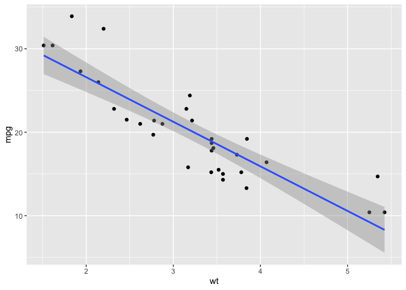

#My Project


## This is Quarto


lets do some writing here. LETS GO!!!

```r
    a <- rnorm(5)
    print(a)
 ```
   
```
    [1] -0.1821547 -0.6316682  0.8385151  0.2709351  0.3785188
```    

bla bla bla this is fun

```r
    # ggplot2 plot
    library(ggplot2)
    ggplot(mtcars, aes(x = wt, y = mpg)) +
    geom_point() +
    geom_smooth(method = "lm")
```
    
```
    `geom_smooth()` using formula = 'y ~ x'
```    



some text here

```r
    A <- rnorm(100)
    hist(A)
```    


1.  hello!
